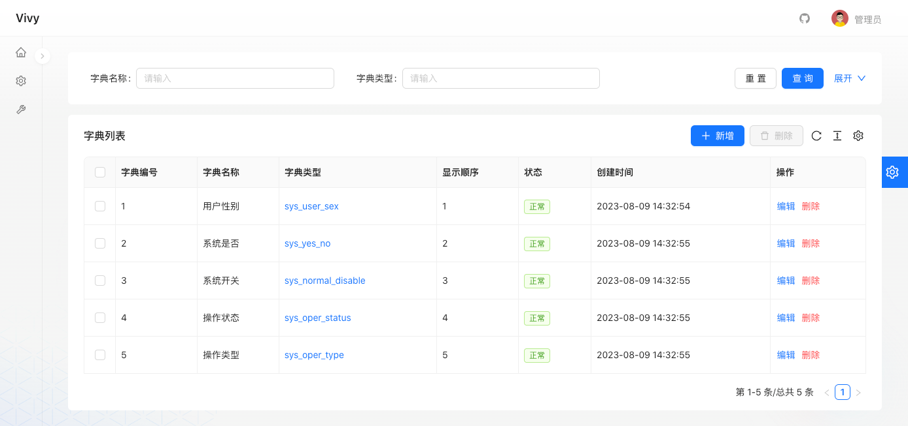

<p align="center">
  
</p>
<h1 align="center">Vivy Nest Admin</h1>
<h4 align="center">基于 Nest.js & React.js 的后台权限管理系统</h4>
<p align="center">
	<a href="https://github.com/haiweilian/vivy-nest-admin">
    
  </a>
  <a href="https://github.com/nestjs/nest">
    
  </a>
  <a href="https://github.com/facebook/react">
    
  </a>
	<a href="https://github.com/haiweilian/vivy-nest-admin/blob/main/LICENSE">
    
  </a>
</p>

## 简介

- [>>> 代办列表 >>>](https://github.com/users/haiweilian/projects/3)
- 采用前后端分离的模式，使用 `Monorepo` 组织项目模块。
- 后端使用 `Nest`、`MySQL`、`TypeORM`、`Redis` 等技术。
- 前端使用 `React`、`Umi Max`、`Ant Design` 等技术。
- 演示地址：<http://43.140.221.180:8000>
- 文档地址：<https://haiweilian.github.io/vivy-nest-admin>
- 掘金专栏：<https://juejin.cn/column/7316725867087003687>

## 系统模块

```
vivy
├── docs                  // 项目文档
├── docker                // 环境配置
├── vivy-react            // 前端项目
├── vivy-common           // 通用模块
│       └── vivy-common-core                        // 核心模块
│       └── vivy-common-excel                       // 表格模块
│       └── vivy-common-logger                      // 日志模块
│       └── vivy-common-security                    // 安全模块
│       └── vivy-common-swagger                     // 系统接口
│       └── vivy-plugin-config                      // Config插件
│       └── vivy-plugin-mybatis                     // Mybatis插件
├── vivy-modules          // 业务模块
│       └── vivy-system                             // 系统模块
│       └── vivy-template                           // 模板模块
```

## 内置功能

- [x] 用户管理：用户是系统操作者，该功能主要完成系统用户配置。
- [x] 部门管理：配置系统组织机构（公司、部门、小组），树结构展现支持数据权限。
- [x] 岗位管理：配置系统用户所属担任职务。
- [x] 菜单管理：配置系统菜单，操作权限，按钮权限标识等。
- [x] 角色管理：角色菜单权限分配、设置角色按机构进行数据范围权限划分。
- [x] 字典管理：对系统中经常使用的一些较为固定的数据进行维护。
- [x] 参数管理：对系统动态配置常用参数。
- [x] 通知公告：系统通知公告发布维护。
- [x] 操作日志：系统操作日志记录和查询。
- [x] 登录日志：系统登录日志记录和查询。
- [x] 在线用户：当前系统中活跃用户状态监控。
- [x] 定时任务：在线（添加、修改、删除)任务调度包含执行结果日志。
- [x] 代码生成：前后端代码的生成及下载。
- [x] 系统接口：根据业务代码自动生成相关的接口文档。
- [x] 桌面应用：基于 Electron 构建桌面应用程序。

## 演示图

<table>
  <tr>
    <td></td>
    <td></td>
  </tr>
  <tr>
    <td></td>
    <td></td>
  </tr>
</table>
